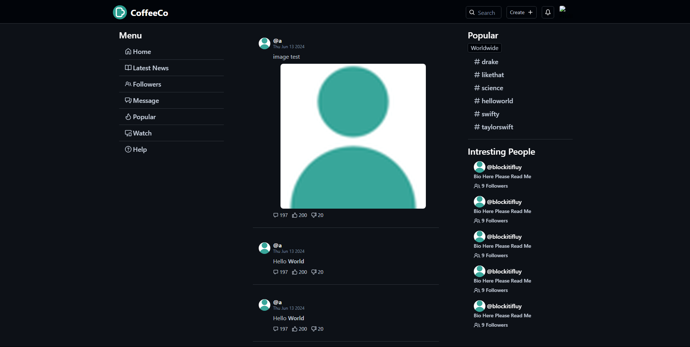

<!--Used https://github.com/othneildrew/Best-README-Template/blob/master/README.md-->

<div align="center">
  
  <h3>CoffeeCo - The Social Media App</h3>
  <p>CoffeeCo is an open-source social media app; All about Personalisation and Privacy.</p>
  <a href="./CHANGELOG.md">View Changelog »</a>
</div>

# About The Project



CoffeeCo's main goal focuses on:

- User Personalistion,
- User Privacy,
- Performance

CoffeeCo ensures privacy by you being able to run and compile on your own home PC. The benefit of an open source website, is that anyone can rapidly update to be come better. To compile download [Go](https://go.dev) and [npm](https://nodejs.org/download).

## Built With

- [Go](https://www.go.dev/)
- [Solid.js](https://www.solidjs.com/)
- [Typescript](https://www.typescriptlang.org/)
- [Tailwind.css](https://www.tailwindcss.com/)

# Getting Started

## Compile Server

```bash
  go build
```

Then, run the `coffeecoserver.exe`.

## Compile Frontend

```bash
  npm run build
```

Then, see the `dist` folder.

## New build

To make a new build run [buildrelease.py](./meta/buildrelease.py), and do the steps supplied.

# Usage

Use this space to show useful examples of how a project can be used. Additional screenshots, code examples and demos work well in this space. You may also link to more resources.

For more examples, please refer to the [Documentation](./DOCUMENTATION.md).

# Roadmap

To see Roadmap go to [this Trello Board](https://trello.com/b/qI7UAaDw/coffeeco).

To see Changelog go to [here](./CHANGELOG.md).

# License

Distributed under the MIT License. See [LICENSE](./LICENSE) for more information.
